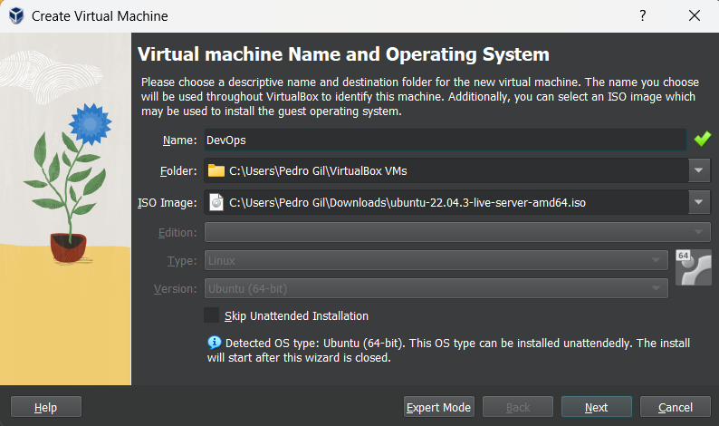
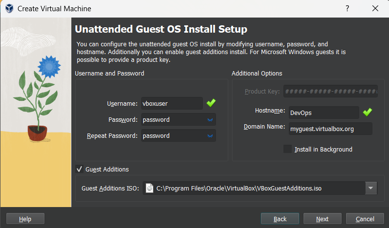
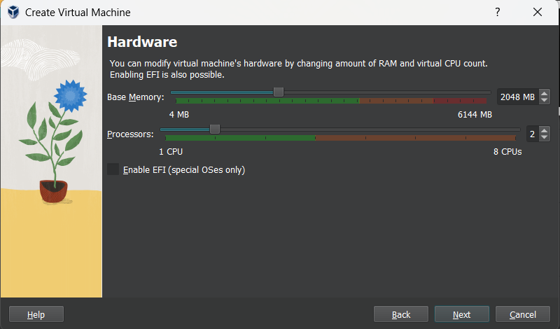
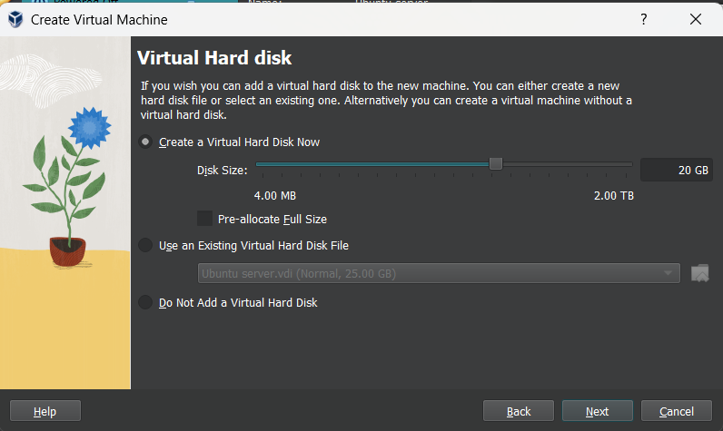

# CA3, Part 1 - Virtualization with Vagrant

- ## Start by creating your VM:

1. Download and Install VirtualBox or UTM: Start by downloading VirtualBox from [Oracle's website](https://www.virtualbox.org/) or UTM from [UTM's website](https://mac.getutm.app/) if you are using an Apple machine with ARM64.

2. Download the Ubuntu Server ISO file from [Ubuntu's official site](https://ubuntu.com/download/server).
3. Open VirtualBox/UTM and click on "New" to create a new virtual machine.
4. Name your VM and select Ubuntu Server ISO file.


5. Select a username and password for your VM and check the box to install Guest Additions.


6. Allocate memory and processor cores to your VM.


7. Create a virtual hard disk for your VM.



8. Start the VM and follow the on-screen instructions to install Ubuntu. During installation, select the standard utilities for a server and, if prompted.
- ## Install the dependencies of the projects
1. Install git
```bash
sudo apt install git
```
2. Install maven
```bash
sudo apt install maven
```
3. Install gradle
```bash
sudo apt install gradle
```
4. Install java 17 (version 17 was installed in order for the CA2 Part2 to be able to run).

```bash
sudo apt install openjdk-17-jdk openjdk-17-jre
```
5. Verify version:
```bash
java -version
```
6. If you have the wrong version, you can change it with the following command:
```bash
sudo update-alternatives --config java
```

- ## Clone the repository
- Create folder and clone the repository
```bash
mkdir ~/myProjects
git clone <repository-url>
```


- ## Configure maven wrapper and gradle wrapper
- Go to the root of the project and run the following commands to allow executing permissions:
```bash
chmod +x mvnw
chmod +x gradlew
```
- ## Run Class Assignment 1
- Run the project inside the VM
```bash
cd CA1/basic
./mvnw install
./mvnw spring-boot:run
```
- Use the IP address of the virtual machine (VM) and the port that was set up in the project to access the application 
from the web browser on your host computer to ensure that it is operating properly.(http:// VM-ip : port-number /)
```bash
ip addr
```
- ## Run Class Assignment 2 part 1
- Run the server inside the VM
```bash
cd CA2/part1
./gradlew build
./gradlew runServer
```
- Run the clients in your host machine. (Replace the IP address with the IP address of the VM and the port number with the port number that was set up in the project)
```bash
cd CA2/part1
./gradlew build
./gradlew runClient --args="<ip> <port>"
```
- ## Run Class Assignment 2 part 2
- Run the project inside the VM
```bash
cd CA2/part2
./gradlew build
./gradlew bootRun
```
- Use the IP address of the virtual machine (VM) and the port that was set up in the project to access the application
  from the web browser on your host computer to ensure that it is operating properly.(http:// VM-ip : port-number /)
```bash
ip addr
```