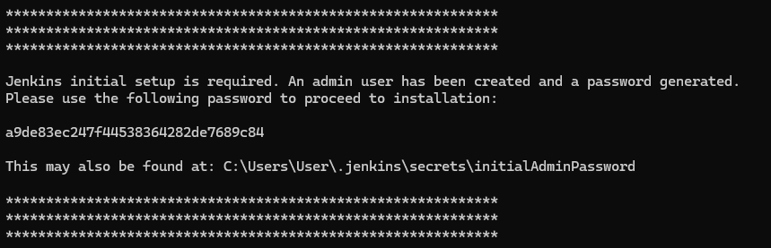

# CA5 — CI/CD Pipelines with Jenkins

## Introduction

In today's fast-paced software development environment, Continuous Integration and Continuous Deployment (CI/CD) have 
become essential practices for delivering high-quality software quickly and efficiently. CI/CD pipelines automate the 
process of building, testing, and deploying applications, ensuring that code changes are integrated smoothly and deployed 
seamlessly.

This assignment, Class Assignment 5 (CA5), focuses on the practical implementation of CI/CD pipelines using Jenkins, 
a widely adopted open-source automation server. Throughout this assignment, you will gain hands-on experience in setting 
up and configuring Jenkins pipelines to automate the build and deployment processes for Java-based applications.

## Table of Contents

1. [Overview](#overview)
2. [Practice](#practice)
3. [Conclusion](#conclusion)

## Overview

The primary objectives of this assignment are to:

1. Set up a Jenkins:
     - Install and configure Jenkins on your local machine or a cloud instance.
     - Explore the Jenkins user interface and familiarize yourself with its key features and functionalities.

2. Create CI/CD Pipelines:
     - Develop CI/CD pipelines for a basic Gradle project and a Spring Boot application.
     - Automate various stages of the software development lifecycle, including code checkout, building, testing, 
   and archiving artifacts.

3. Integrate with Version Control:
     - Integrate Jenkins with your version control system (GitHub) to automatically trigger builds on code commits.
     - Use Jenkins credentials management to securely handle access to private repositories.

4. Publish Docker Images:
     - Generate Docker images for the Spring Boot application and publish them to Docker Hub.
     - Understand the process of containerizing applications and integrating Docker with Jenkins.

## Practice 

We chose to install Jenkins on a local machine for this assignment.
Go to the [Jenkins Installation](https://www.jenkins.io/download/) page to download the latest version of Jenkins 
for your operating system.

Go to the directory where the Jenkins WAR file is located and run the following command to start a Jenkins server
and specify the HTTP port on which Jenkins will listen (in this case, port 8080):

```bash
java -jar jenkins.war --httpPort=8080
```

Once Jenkins is up and running, open a web browser and navigate to `http://localhost:8080` to access the Jenkins dashboard.

To unlock Jenkins, you will need to retrieve the initial administrator password from the Jenkins server's console output or
the `.jenkins\secrets\initialAdminPassword` file. (See the following screenshot for reference)



After unlocking Jenkins, you can install the recommended plugins (also install HTML Publisher, Docker, Docker Commons, 
Docker Pipeline, Docker API, docker-build-step)  Once the installation is complete, create an account.

Next, create a new Jenkins pipeline by selecting "New Item" from the Jenkins dashboard, entering a name for the pipeline,
and choosing the "Pipeline" option. In the pipeline configuration, you can define the pipeline script using the Jenkinsfile.

For the basic Gradle project, the Jenkinsfile script will include stages for checking out the code, building the project,
running tests, and archiving the artifacts. You can use the following script as a reference:

```groovy
pipeline {
    agent any

    environment {
        REPO_URL = 'https://github.com/PedroHGill/devops-23-24-JPE-1231851.git'
    }

    stages {
        stage('Checkout') {
            steps {
                echo 'Checking out the code...'
                git url: "${REPO_URL}", branch: 'master'
            }
        }
        
        stage('Assemble') {
            steps {
                dir('CA2/part1/') { 
                    echo 'Assembling the application...'
                    bat './gradlew assemble'
                }
            }
        }
        
        stage('Test') {
            steps {
                dir('CA2/part1/') {
                    echo 'Running unit tests...'
                    bat './gradlew test'
                    junit 'build/test-results/test/*.xml'
                }
            }
        }
        
        stage('Archive') {
            steps {
                dir('CA2/part1/') {
                    echo 'Archiving artifacts...'
                    archiveArtifacts artifacts: 'build/libs/*.jar', fingerprint: true
                }
            }
        }
    }
}
```

## Pipeline in Jenkins to build the tutorial spring boot application

The second Jenkinsfile is similar to the first one, but it has an extra stage that pushes the Docker image to Dockerhub.
The Jenkinsfile for the second pipeline is shown below:

```groovy
pipeline {
   agent any

   environment {
      DOCKER_CREDENTIALS_ID = '32f08b30-b602-4f85-932a-3cb498ad7d7d'
      DOCKER_IMAGE = 'pedrohgil/springbootapp'
      DOCKER_TAG = "${env.BUILD_ID}"
   }

   stages {
      stage('Checkout') {
         steps {
            echo 'Checking out the code...'
            git url: 'https://github.com/PedroHGill/devops-23-24-JPE-1231851.git'
         }
      }

      stage('Set Permissions') {
         steps {
            dir('CA2/part2/') {
               echo 'Setting executable permissions on gradlew...'
               bat 'gradlew.bat'
            }
         }
      }

      stage('Assemble') {
         steps {
            dir('CA2/part2/') {
               echo 'Assembling the application...'
               bat './gradlew assemble'
            }
         }
      }

      stage('Test') {
         steps {
            dir('CA2/part2/') {
               echo 'Running unit tests...'
               bat './gradlew test'
            }
         }
      }

      stage('Javadoc') {
         steps {
            dir('CA2/part2/') {
               echo 'Generating Javadoc...'
               bat './gradlew javadoc'
               publishHTML(target: [
                       allowMissing: false,
                       alwaysLinkToLastBuild: false,
                       keepAll: true,
                       reportDir: 'build/docs/javadoc',
                       reportFiles: 'index.html',
                       reportName: 'Javadoc'
               ])
            }
         }
      }

      stage('Archive') {
         steps {
            dir('CA2/part2/') {
               echo 'Archiving artifacts...'
               archiveArtifacts artifacts: 'build/libs/*.jar', fingerprint: true
            }
         }
      }

      stage('Create Dockerfile') {
         steps {
            script {
               def dockerfileContent = """
                     FROM tomcat:10
                     RUN apt-get update && apt-get install -y dos2unix
                     WORKDIR /app
                     COPY . .
                     EXPOSE 8080
                     RUN dos2unix ./gradlew
                     ENTRYPOINT ["./gradlew"]
                     CMD ["bootRun"]
                     """
               writeFile file: 'Dockerfile', text: dockerfileContent
            }
         }
      }

      stage('Publish Image') {
         steps {
            script {
               echo 'Building and publishing Docker image...'
               docker.withRegistry('https://index.docker.io/v1/', "${DOCKER_CREDENTIALS_ID}") {
                  dir('CA2/part2/') {
                     def customImage = docker.build("${DOCKER_IMAGE}:${DOCKER_TAG}")
                     customImage.push('latest')
                  }
               }
            }
         }
      }
   }
}

```

## Conclusion

In conclusion, this report detailed the process of setting up Jenkins pipelines for a project that uses a variety of
technologies including Java, JavaScript, Spring Boot, Maven, NPM, React, Gradle, and Ruby. The pipelines were designed
to automate several stages of the development process, including code checkout, assembly, testing, archiving of
artifacts, and publishing of Docker images.

The first pipeline was a simpler version, created for practice, which performed the basic tasks of checkout, assembly,
testing, and archiving. The second pipeline, which was more complex, added the stages of generating Javadoc and
publishing a Docker image to DockerHub.

During the process, several challenges were encountered, particularly related to the differences between Unix-like and
Windows operating systems. These challenges were addressed by modifying the Jenkinsfile to use commands compatible with
the Windows environment.

The report also highlighted the importance of using the correct commands and environment variables for the specific
operating system on which Jenkins is running. It demonstrated how to troubleshoot common errors and provided solutions
to ensure the successful execution of the Jenkins pipelines.

Overall, the successful setup of these Jenkins pipelines represents a significant step towards automating and
streamlining the development process, thereby improving productivity and efficiency.


